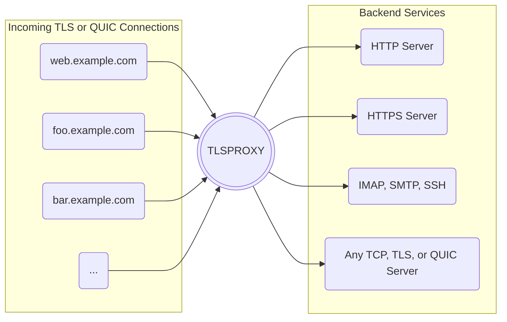

[](https://github.com/c2FmZQ/tlsproxy/actions/workflows/pr.yml)
[](https://github.com/c2FmZQ/tlsproxy/actions/workflows/release.yml)
[](https://github.com/c2FmZQ/tlsproxy/actions/workflows/github-code-scanning/codeql)

# TLS Termination Proxy

TLSPROXY is primarily a [TLS termination proxy](https://en.wikipedia.org/wiki/TLS_termination_proxy) that uses Let's Encrypt to provide TLS encryption for any number of TCP or HTTP servers, and any number of server names concurrently on the same port.

TLSPROXY can also be used as a simple [Web server](https://en.wikipedia.org/wiki/Web_server), or a [Reverse Proxy](https://en.wikipedia.org/wiki/Reverse_proxy) for HTTP(S) services, and optionally control access to these services with user authentication and authorization.

Overview of features:

* [x] Use [Let's Encrypt](https://letsencrypt.org/) automatically to get TLS certificates (http-01 & tls-alpn-01 challenges).
* [x] Terminate TLS connections, and forward the data to any TCP server in plaintext.
* [x] Terminate TLS connections, and forward the data to any TLS server. The data is encrypted in transit, but the proxy sees the plaintext.
* [x] Terminate _TCP_ connections, and forward the TLS connection to any TLS server (passthrough). The proxy doesn't see the plaintext.
* [x] Terminate [QUIC](https://github.com/c2FmZQ/tlsproxy/blob/main/docs/QUIC.md) connections, and forward the data to any QUIC or TLS/TCP server.
* [x] Terminate HTTPS connections, and forward the requests to HTTP or HTTPS servers (http/1.1, http/2, http/3).
* [x] Support Encrypted Client Hello ([ECH](https://github.com/c2FmZQ/tlsproxy/blob/main/docs/ECH.md)).
* [x] Serve static files from a local filesystem.
* [x] Support for the [PROXY protocol](https://github.com/haproxy/haproxy/blob/master/doc/proxy-protocol.txt) defined by HAProxy. (not on QUIC or HTTP/3 backends)
* [x] TLS client authentication & authorization (when the proxy terminates the TLS connections).
* [x] Built-in [Certificate Authority](https://github.com/c2FmZQ/tlsproxy/tree/main/examples/pki#readme) for managing client and backend server TLS certificates.
* [x] Built-in [Certificate Authority](https://github.com/c2FmZQ/tlsproxy/tree/main/examples/ssh#readme) for issuing SSH Certificates..
* [x] User authentication with OpenID Connect, SAML, and/or passkeys (for HTTP and HTTPS connections). Optionally issue JSON Web Tokens (JWT) to authenticated users to use with the backend services and/or run a local OpenID Connect server for backend services.
* [x] Access control by IP address.
* [x] Routing based on Server Name Indication (SNI), with optional default route when SNI isn't used.
* [x] Simple round-robin load balancing between servers.
* [x] Support any ALPN protocol in TLS, TLSPASSTHROUGH, QUIC, or TCP mode.
* [x] OCSP stapling and OCSP certificate verification.
* [x] Support for TLS certificates stored locally.
* [x] Hardware-backed cryptographic keys for encryption and signing with a [TPM](https://github.com/c2FmZQ/tlsproxy/blob/main/docs/TPM.md).
* [x] Use the same address (IPAddr:port) for any number of server names, e.g. foo.example.com and bar.example.com on the same xxx.xxx.xxx.xxx:443.



## Example config:

```yaml
# (Required) Indicate acceptance of the Let's Encrypt Terms of Service.
acceptTOS: true
# (Optional) The email address is used by Let's Encrypt to send important notifications.
email: <your email address>

# The HTTP address must be reachable from the internet via port 80 for the
# letsencrypt ACME http-01 challenge to work. If the httpAddr is empty, the
# proxy will only use tls-alpn-01 and tlsAddr must be reachable on port 443.
# See https://letsencrypt.org/docs/challenge-types/
# Normal HTTP requests received on this port are redirected to port 443.
httpAddr: ":10080"

# The proxy will receive TLS connections at this address and forward them to
# the backends.
tlsAddr: ":10443"

# Each backend has a list of server names (DNS names that clients connect to),
# and addresses (where to forward connections).
backends:

# In HTTP mode, HTTPS requests to example.com and www.example.com are forwarded
# to the listed addresses using round robin load balancing.
- serverNames:
  - example.com
  - www.example.com
  mode: http
  addresses:
  - 192.168.0.10:80
  - 192.168.0.11:80
  - 192.168.0.12:80

# In HTTPS mode, HTTPS requests to other.example.com are forwarded to the listed
# addresses just like in http mode. The connection between the proxy and the
# backend server(s) uses TLS. The identity of the server is verified with
# forwardServerName, forwardRootCAs, and/or insecureSkipVerify.
- serverNames:
  - other.example.com
  mode: https
  addresses:
  - 192.168.1.100:443
  insecureSkipVerify: true

# In TCP mode, incoming TLS connections are forwarded to the listed addresses
# using unencrypted TCP connections. The connections are distributed between
# backend servers using round robin load balancing.
- serverNames:
  - ssh.example.com
  mode: tcp
  addresses:
  - 192.168.2.200:22

# In TLS mode, incoming TLS connections are forwarded to the listed addresses
# using TLS. The connections are distributed between backend servers using round
# robin load balancing. The identity of the server is verified with
# forwardServerName, forwardRootCAs, and/or insecureSkipVerify.
- serverNames:
  - secure.example.com
  mode: tls
  addresses:
  - 192.168.3.123:8443
  forwardServerName: secure-internal.example.com

# In all modes (except tlspassthrough), the client identity can be verified by
# setting clientAuth, and optionally setting rootCAs and acl.
- serverNames:
  - restricted.example.com
  mode: https
  clientAuth:
    rootCAs:
    - |
      -----BEGIN CERTIFICATE-----
      .....
      -----END CERTIFICATE-----
    acl:
    - SUBJECT:CN=admin-user
  addresses:
  - 192.168.4.100:443
  forwardServerName: restricted-internal.example.com

# In TLSPASSTHROUGH mode, incoming TLS connections are forwarded directly to the
# backend servers. The proxy only sees the encrypted content transmitted between
# the client and the backend servers. The backend servers need to have their own
# TLS certificates and, if client authentication is required, they need to do it
# themselves.
- serverNames:
  - passthrough.example.com
  mode: tlspassthrough
  addresses:
  - 192.168.5.66:8443

# When documentRoot is set, static content is served from that directory.
# (The addresses field must be empty)
- serverNames: 
  - static.example.com
  mode: local
  documentRoot: /var/www/htdocs
```

See the [godoc](https://pkg.go.dev/github.com/c2FmZQ/tlsproxy/proxy#section-documentation) and the [examples](https://github.com/c2FmZQ/tlsproxy/blob/main/examples) directory for more details.


## How to download and run tlsproxy

### From source

Install from the source code:
```console
git clone https://github.com/c2FmZQ/tlsproxy.git
cd tlsproxy
go generate ./...
go build -o tlsproxy
```

Then, run it with:
```console
<path>/tlsproxy --config=config.yaml
```

### Docker image

Use the [docker image](https://hub.docker.com/r/c2fmzq/tlsproxy), e.g.
```console
docker run                                 \
  --name=tlsproxy                          \
  --user=1000:1000                         \
  --restart=always                         \
  --volume=${CONFIGDIR}:/config            \
  --volume=${CACHEDIR}:/.cache             \
  --publish=80:10080                       \
  --publish=443:10443                      \
  --env=TLSPROXY_PASSPHRASE="<passphrase>" \
  c2fmzq/tlsproxy:latest
```

The proxy reads the config from `${CONFIGDIR}/config.yaml`.

:warning: `${TLSPROXY_PASSPHRASE}` is used to encrypt the TLS secrets.

### Precompiled binaries

Download a precompiled binary from the [release page](https://github.com/c2FmZQ/tlsproxy/releases).

## Verify signatures

The release binaries and the container images are signed when they are published.

### Container image

To verify the authenticity of a container image, use:

```console
cosign verify \
  --certificate-identity-regexp='^https://github[.]com/c2FmZQ/tlsproxy/[.]github/workflows/release[.]yml' \
  --certificate-oidc-issuer=https://token.actions.githubusercontent.com                                   \
  c2fmzq/tlsproxy:latest
```

and/or:

```console
cosign verify --key keys/cosign.pub c2fmzq/tlsproxy:latest
```

### Release binary

To verify the authenticity of a release binary, first import `c2FmZQ-bot.pub`:

```console
curl https://raw.githubusercontent.com/c2FmZQ/tlsproxy/main/keys/c2FmZQ-bot.pub | gpg --import
```

Then, verify the signature, e.g.

```console
gpg --verify tlsproxy-linux-amd64.sig tlsproxy-linux-amd64
```
