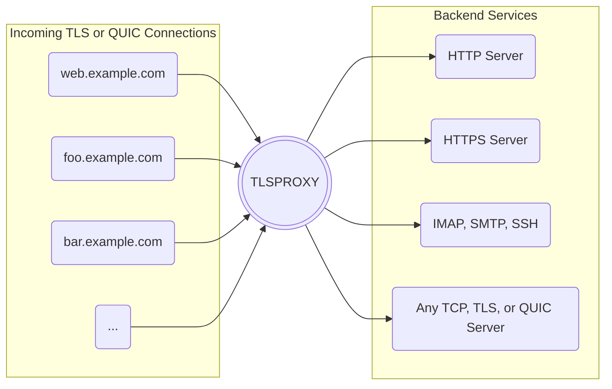

[](https://github.com/c2FmZQ/tlsproxy/actions/workflows/pr.yml)
[](https://github.com/c2FmZQ/tlsproxy/actions/workflows/release.yml)
[](https://github.com/c2FmZQ/tlsproxy/actions/workflows/github-code-scanning/codeql)

# TLSPROXY



## 1. Overview

TLSPROXY is a versatile [TLS termination proxy](https://en.wikipedia.org/wiki/TLS_termination_proxy) designed to secure various network services. It automatically handles TLS encryption using [Let's Encrypt](https://letsencrypt.org/), allowing multiple services and server names to share the same port. Beyond TLS termination, TLSPROXY can function as a simple [web server](https://en.wikipedia.org/wiki/Web_server), a [reverse proxy](https://en.wikipedia.org/wiki/Reverse_proxy) for HTTP(S) services, and offers robust user authentication and authorization features.

**Key Features:**

*   **Automatic TLS Certificates:** Integrates with Let's Encrypt for automatic certificate acquisition using http-01 and tls-alpn-01 challenges.
*   **Flexible TLS Termination:**
    *   Terminates TLS and forwards data to TCP servers in plain text.
    *   Terminates TLS and forwards data to TLS servers (encrypted in transit, proxy sees plain text).
    *   Passes through raw TLS connections to backend TLS servers (proxy does not see plain text).
*   **QUIC and HTTP/3 Support:** Terminates QUIC connections and forwards data to QUIC or TLS/TCP servers.
*   **Encrypted Client Hello (ECH):** Enhances privacy by encrypting ClientHello messages.
*   **Static File Serving:** Can serve static content directly from the local filesystem.
*   **PROXY Protocol Support:** Integrates with the PROXY protocol for incoming TCP connections (not for QUIC or HTTP/3 backends).
*   **Client Authentication & Authorization:** Supports TLS client authentication and authorization when the proxy terminates TLS connections.
*   **Built-in Certificate Authorities:**
    *   Manages client and backend server TLS certificates.
    *   Issues SSH user certificates based on SSO credentials.
*   **User Authentication:** Supports OpenID Connect, SAML, and Passkeys for HTTP and HTTPS connections. Can optionally issue JSON Web Tokens (JWTs) and run a local OpenID Connect server.
*   **Access Control:** Implements access control based on IP addresses.
*   **Routing & Load Balancing:** Routes requests based on Server Name Indication (SNI) with optional default routes and simple round-robin load balancing.
*   **ALPN Protocol Support:** Supports any ALPN protocol in TLS, TLSPASSTHROUGH, QUIC, or TCP mode.
*   **OCSP Stapling & Verification:** Includes OCSP stapling and certificate verification.
*   **Local TLS Certificates:** Supports using locally stored TLS certificates.
*   **Hardware-backed Cryptographic Keys:** Can use a Trusted Platform Module (TPM) for enhanced security of cryptographic keys.
*   **Port Sharing:** Allows multiple server names to share the same IP address and port.

## 2. Installation

### From Source

To install TLSPROXY from its source code, follow these steps:

```console
git clone https://github.com/c2FmZQ/tlsproxy.git
cd tlsproxy
go generate ./...
go build -o tlsproxy
```

### Docker Image

You can use the official Docker image from [Docker Hub](https://hub.docker.com/r/c2fmzq/tlsproxy). Here's an example command:

```console
docker run \
  --name=tlsproxy \
  --user=1000:1000 \
  --restart=always \
  --volume=${CONFIGDIR}:/config \
  --volume=${CACHEDIR}:/.cache \
  --publish=80:10080 \
  --publish=443:10443 \
  --env=TLSPROXY_PASSPHRASE="<passphrase>" \
  c2fmzq/tlsproxy:latest
```

The proxy reads the configuration from ${CONFIGDIR}/config.yaml.

:warning: The `${TLSPROXY_PASSPHRASE}` environment variable is crucial as it's used to encrypt the TLS secrets.

### Precompiled Binaries

Precompiled binaries for various platforms are available on the [release page](https://github.com/c2FmZQ/tlsproxy/releases).

### Verifying Signatures

It is highly recommended to verify the authenticity of downloaded binaries and container images.

**Container Image:**

To verify the authenticity of a container image, use `cosign`:

```console
cosign verify \
  --certificate-identity-regexp='^https://github[.]com/c2FmZQ/tlsproxy/[.]github/workflows/release[.]yml' \
  --certificate-oidc-issuer=https://token.actions.githubusercontent.com \
  c2fmzq/tlsproxy:latest
```

Alternatively, if you have the public key:

```console
cosign verify --key keys/cosign.pub c2fmzq/tlsproxy:latest
```

**Release Binary:**

To verify the authenticity of a release binary, first import the `c2FmZQ-bot.pub` key:

```console
curl https://raw.githubusercontent.com/c2FmZQ/tlsproxy/main/keys/c2FmZQ-bot.pub | gpg --import
```

Then, verify the signature (e.g., for `tlsproxy-linux-amd64`):

```console
gpg --verify tlsproxy-linux-amd64.sig tlsproxy-linux-amd64
```

## 3. Configuration

TLSPROXY is configured using a YAML file, typically named `config.yaml`. This file defines how the proxy behaves, including backend services, authentication methods, and security settings.

### `config.yaml` Structure

The main configuration options are:

*   `acceptTOS`: (Required) Boolean. Indicates acceptance of the Let's Encrypt Terms of Service. Must be `true` for Let's Encrypt to function.
*   `email`: (Optional) String. Your email address, used by Let's Encrypt for important notifications.
*   `httpAddr`: (Optional) String. The address where the proxy listens for HTTP connections (e.g., `":80"` or `":10080"`). Essential for Let's Encrypt's http-01 challenge.
*   `tlsAddr`: (Required) String. The address where the proxy listens for TLS connections (e.g., `":443"` or `":10443"`).
*   `enableQUIC`: (Optional) Boolean. Enables QUIC protocol support. Defaults to `true` if compiled with QUIC support.
*   `ech`: (Optional) Object. Configures Encrypted Client Hello (ECH).
*   `acceptProxyHeaderFrom`: (Optional) List of CIDRs. Enables PROXY protocol for connections from specified IP ranges.
*   `hwBacked`: (Optional) Boolean. Enables hardware-backed cryptographic keys (e.g., with a TPM).
*   `cacheDir`: (Optional) String. Directory for storing TLS certificates, OCSP responses, etc. Defaults to a system cache directory.
*   `defaultServerName`: (Optional) String. Server name to use when SNI is not provided by the client.
*   `logFilter`: (Optional) Object. Controls what gets logged (connections, requests, errors).
*   `groups`: (Optional) List of `Group` objects. Defines user groups for access control.
*   `backends`: (Required) List of `Backend` objects. Defines the services TLSPROXY will forward traffic to.
*   `oidc`: (Optional) List of `ConfigOIDC` objects. Defines OpenID Connect identity providers.
*   `saml`: (Optional) List of `ConfigSAML` objects. Defines SAML identity providers.
*   `passkey`: (Optional) List of `ConfigPasskey` objects. Defines Passkey managers.
*   `pki`: (Optional) List of `ConfigPKI` objects. Defines local Certificate Authorities.
*   `sshCertificateAuthorities`: (Optional) List of `ConfigSSHCertificateAuthority` objects. Defines local SSH Certificate Authorities.
*   `tlsCertificates`: (Optional) List of `TLSCertificate` objects. Specifies pre-existing TLS certificates to use.
*   `bwLimits`: (Optional) List of `BWLimit` objects. Defines named bandwidth limit groups.
*   `webSockets`: (Optional) List of `WebSocketConfig` objects. Defines WebSocket endpoints.

See the [GoDoc](https://pkg.go.dev/github.com/c2FmZQ/tlsproxy/proxy#Config) complete up-to-date documentation.

### Backend Configuration (`Backend` Object)

Each `Backend` object defines a service and its behavior:

*   `serverNames`: (Required) List of strings. DNS names for this service.
*   `mode`: (Required) String. Controls how the proxy communicates with the backend. Valid values include `TCP`, `TLS`, `TLSPASSTHROUGH`, `QUIC`, `HTTP`, `HTTPS`, `LOCAL`, `CONSOLE`.
*   `addresses`: (Optional) List of strings. Backend server addresses (e.g., `192.168.1.10:80`).
*   `documentRoot`: (Optional) String. Directory for serving static files (only if `addresses` is empty).
*   `clientAuth`: (Optional) Object. Configures TLS client authentication.
    *   `acl`: (Optional) List of strings. Restricts client identities (email, subject, DNS, URI).
    *   `rootCAs`: (Optional) List of strings. CA names or PEM-encoded certificates for client verification.
    *   `addClientCertHeader`: (Optional) List of strings. Specifies which client certificate fields to add to `X-Forwarded-Client-Cert` header.
*   `sso`: (Optional) Object. Configures Single Sign-On for the backend.
    *   `provider`: String. Name of an OIDC or SAML provider.
    *   `rules`: List of `SSORule` objects. Defines path-matching rules for SSO enforcement.
    *   `htmlMessage`: String. HTML message displayed on permission denied screen (not escaped).
    *   `setUserIdHeader`: Boolean. Sets `x-tlsproxy-user-id` header with user's email.
    *   `generateIdTokens`: Boolean. Generates ID tokens for authenticated users.
    *   `localOIDCServer`: Object. Configures a local OpenID Provider.
*   `exportJwks`: (Optional) String. Path to export the proxy's JSON Web Key Set.
*   `alpnProtos`: (Optional) List of strings. ALPN protocols supported by this backend.
*   `backendProto`: (Optional) String. Protocol for forwarding HTTPS requests to the backend (e.g., `http/1.1`, `h2`, `h3`).
*   `insecureSkipVerify`: (Optional) Boolean. Disables backend server TLS certificate verification (use with caution).
*   `forwardServerName`: (Optional) String. ServerName to send in TLS handshake with backend.
*   `forwardRootCAs`: (Optional) List of strings. CA names or PEM-encoded certificates for backend verification.
*   `forwardTimeout`: (Optional) Duration. Connection timeout to backend servers.
*   `forwardHttpHeaders`: (Optional) Map of strings. HTTP headers to add to forwarded requests.
*   `forwardECH`: (Optional) Object. ECH parameters for connecting to the backend.
*   `pathOverrides`: (Optional) List of `PathOverride` objects. Defines different backend parameters for specific path prefixes.
*   `proxyProtocolVersion`: (Optional) String. Enables PROXY protocol on this backend (`v1` or `v2`).
*   `sanitizePath`: (Optional) Boolean. Sanitizes request path before forwarding (defaults to `true`).
*   `serverCloseEndsConnection`: (Optional) Boolean. Closes TCP connection when server closes its end.
*   `clientCloseEndsConnection`: (Optional) Boolean. Closes TCP connection when client closes its end.
*   `halfCloseTimeout`: (Optional) Duration. Timeout for half-closed TCP connections.

#### SSORule Object

The `SSORule` object allows for fine-grained control over SSO enforcement based on request paths. Each rule in the `rules` list is evaluated in order, and the first matching rule is applied.

*   `paths`: (Optional) List of strings. A list of path prefixes to which this rule applies. If empty, the rule matches all paths.
*   `exceptions`: (Optional) List of strings. A list of path prefixes that are exempt from this rule.
*   `forceReAuth`: (Optional) Duration. A time duration after which the user must re-authenticate, even if their session is still valid.
*   `acl`: (Optional) List of strings. A list of email addresses or domains (e.g., `bob@example.com`, `@example.com`) that are allowed access. If not provided, all authenticated users are allowed.
*   `scopes`: (Optional) List of strings. A list of scopes that the user must have to be granted access.

**Example:**

```yaml
sso:
  provider: "my-oidc-provider"
  rules:
    - paths:
      - "/admin/"
      forceReAuth: "1h"
      acl:
      - "admin@example.com"
    - paths:
      - "/public/"
      exceptions:
      - "/public/login"
    - acl:
      - "@example.com"
```

In this example:
1.  Access to `/admin/` requires re-authentication every hour and is restricted to `admin@example.com`.
2.  All paths under `/public/` are subject to SSO, except for `/public/login`.
3.  All other paths are accessible to any authenticated user from the `@example.com` domain.

#### LocalOIDCServer Object

The `localOIDCServer` object allows `tlsproxy` to act as an OpenID Connect (OIDC) provider, issuing tokens to authenticated users. This is useful for services that can authenticate using OIDC.

When `localOIDCServer` is configured, `tlsproxy` exposes the following endpoints:
*   `/.well-known/openid-configuration`
*   `/authorization`
*   `/token`
*   `/jwks`
*   `/device/authorization`
*   `/device/verification`

The paths can be prefixed using the `pathPrefix` field.

*   `pathPrefix`: (Optional) String. A prefix for the OIDC endpoints.
*   `tokenLifetime`: (Optional) Duration. The lifetime of the OIDC tokens. Defaults to 10 minutes.
*   `clients`: (Required) List of `LocalOIDCClient` objects. Defines the OIDC clients that are allowed to connect.
*   `rewriteRules`: (Optional) List of `LocalOIDCRewriteRule` objects. Defines rules to rewrite claims in the ID token.
*   `scopes`: (Optional) List of strings. A list of scopes that may be requested by clients.

##### LocalOIDCClient Object

*   `id`: (Required) String. The OIDC client ID.
*   `secret`: (Required) String. The OIDC client secret.
*   `redirectUri`: (Required) List of strings. The OIDC redirect URIs.
*   `acl`: (Optional) List of strings. A list of email addresses or domains (e.g., `bob@example.com`, `@example.com`) that are allowed to use this client.

##### LocalOIDCRewriteRule Object

*   `inputClaim`: (Required) String. The name of the claim to use as input.
*   `outputClaim`: (Required) String. The name of the claim to create or overwrite.
*   `regex`: (Required) String. A regular expression to match against the input claim's value.
*   `value`: (Required) String. The new value for the output claim. Can use capture groups from the regex.

**Example:**

```yaml
sso:
  provider: "my-sso-provider"
  localOIDCServer:
    tokenLifetime: "1h"
    clients:
      - id: "my-app"
        secret: "a-very-secret-string"
        redirectUri:
          - "https://my-app.example.com/oauth2/callback"
        acl:
          - "@example.com"
    rewriteRules:
      - inputClaim: "email"
        outputClaim: "preferred_username"
        regex: "^([^@]+)@.+$"
        value: "$1"
```
In this example:
1.  The local OIDC server will issue tokens with a lifetime of 1 hour.
2.  The client `my-app` is allowed to authenticate, and only users with an email address ending in `@example.com` can use it.
3.  A `preferred_username` claim will be added to the ID token, containing the local part of the user's email address.


### Identity Provider Configuration

*   **`ConfigOIDC` (OpenID Connect):**
    *   `name`: String. Internal name.
    *   `discoveryUrl`: String. Discovery URL.
    *   `authorizationEndpoint`: String. Authorization endpoint.
    *   `scopes`: List of strings. Scopes to request (e.g., `openid`, `email`, `profile`).
    *   `hostedDomain`: String. Restricts login to a specific domain (Google only).
    *   `tokenEndpoint`: String. Token endpoint.
    *   `userinfoEndpoint`: String. Userinfo endpoint.
    *   `redirectUrl`: String. OAuth2 redirect URL.
    *   `clientId`: String. Client ID.
    *   `clientSecret`: String. Client Secret.
    *   `domain`: String. Domain for user identities.

    **Example (Google OpenID Connect):**

    ```yaml
    oidc:
    - name: "google"
      discoveryUrl: "https://accounts.google.com/.well-known/openid-configuration"
      redirectUrl: "https://login.example.com/oidc/google"
      clientId: "<YOUR CLIENT ID>"
      clientSecret: "<YOUR CLIENT SECRET>"
      hostedDomain: "example.com" # Optional: Restrict to a specific Google Workspace domain
    ```

*   **`ConfigSAML` (SAML):**
    *   `name`: String. Internal name.
    *   `ssoUrl`: String. SSO URL.
    *   `entityId`: String. Entity ID.
    *   `certs`: String. PEM-encoded certificates.
    *   `acsUrl`: String. ACS URL.
    *   `domain`: String. Domain for user identities.

    **Example (Google Workspace SAML):**

    ```yaml
    saml:
    - name: "google-saml"
      ssoUrl: "https://accounts.google.com/o/saml2/idp?idpid=<YOUR APP ID>"
      entityId: "https://login.example.com/"
      certs: |
        -----BEGIN CERTIFICATE-----
        ...
        -----END CERTIFICATE-----
      acsUrl: "https://login.example.com/saml"
    ```

*   **`ConfigPasskey` (Passkey):**
    *   `name`: String. Internal name.
    *   `identityProvider`: String. Name of another identity provider for initial authentication.
    *   `refreshInterval`: Duration. Re-authentication interval.
    *   `endpoint`: String. URL for passkey authentication.
    *   `domain`: String. Domain for user identities.

    **Example (Passkey with Google OpenID Connect for initial authentication):**

    ```yaml
    passkey:
    - name: "passkey"
      identityProvider: "google" # Name of the OIDC provider for initial authentication
      endpoint: "https://login.example.com/passkey"
      domain: "example.com"
    ```

### Group and Member Objects

The `groups` section in the configuration allows for the creation of user groups for access control. These groups can be used in `sso` and `clientAuth` rules.

#### `Group` Object

*   `name`: (Required) String. The name of the group.
*   `members`: (Optional) List of `Member` objects.

#### `Member` Object

A member can be identified in one of three ways:
*   `email`: String. The email address of the user. This is used for SSO authentication.
*   `x509`: String. The X.509 subject of a client certificate. This is used for TLS client authentication.
*   `group`: String. The name of another group. This allows for nested groups.

**Example:**

```yaml
groups:
- name: admins
  members:
  - email: "admin@example.com"
  - x509: "SUBJECT:CN=admin"
- name: users
  members:
  - email: "user1@example.com"
  - x509: "SUBJECT:CN=user1"
  - group: "admins" # All admins are also users.

backends:
- serverNames:
  - "sso.example.com"
  sso:
    provider: "my-sso-provider"
    rules:
    - acl:
      - "users" # Only members of the 'users' group can access.
- serverNames:
  - "client-auth.example.com"
  clientAuth:
    rootCAs:
    - "my-ca"
    acl:
    - "admins" # Only members of the 'admins' group can access.
```


### PKI Configuration (`ConfigPKI`)

Defines a local Certificate Authority:

*   `name`: String. Name of the CA.
*   `keyType`: String. Cryptographic key type (e.g., `ecdsa-p256`, `rsa-2048`).
*   `issuingCertificateUrls`: List of strings. URLs for CA's X509 certificate.
*   `crlDistributionPoints`: List of strings. URLs for Certificate Revocation List.
*   `ocspServers`: List of strings. URLs for OCSP.
*   `endpoint`: String. URL for certificate management.
*   `admins`: List of strings. Users allowed to perform administrative tasks.

### SSH Certificate Authority Configuration (`ConfigSSHCertificateAuthority`)

Defines a local SSH Certificate Authority:

*   `name`: String. Name of the CA.
*   `keyType`: String. Cryptographic key type.
*   `publicKeyEndpoint`: String. URL where CA's public key is published.
*   `certificateEndpoint`: String. URL where certificates are issued.
*   `maximumCertificateLifetime`: Duration. Maximum certificate lifetime.

### Bandwidth Limit Configuration (`BWLimit`)

Defines named bandwidth limits:

*   `name`: String. Name of the group.
*   `ingress`: Float. Ingress limit in bytes per second.
*   `egress`: Float. Egress limit in bytes per second.

### WebSocket Configuration (`WebSocketConfig`)

Defines WebSocket endpoints:

*   `endpoint`: String. WebSocket endpoint URL.
*   `address`: String. Backend address for WebSocket connections.
*   `scopes`: List of strings. Scopes for access control.

### ECH Configuration (`ECH` Object)

The `ech` object configures Encrypted Client Hello (ECH). When enabled, `tlsproxy` acts as a Client-Facing Server for all backends.

*   `publicName`: (Required) String. The public name of the ECH configuration.
*   `interval`: (Optional) Duration. The time interval between key/config rotations.
*   `endpoint`: (Optional) String. The local endpoint where `tlsproxy` will publish the current ECH ConfigList.
*   `webhooks`: (Optional) List of strings. A list of webhook URLs to call when the ECH config is updated.
*   `cloudflare`: (Optional) List of `Cloudflare` objects. Configures Cloudflare DNS records to update when the ECH ConfigList changes.

See the [GoDoc](https://pkg.go.dev/github.com/c2FmZQ/tlsproxy/proxy#ECH) for more details.

**Example:**

```yaml
ech:
  publicName: "www.example.com"
  interval: "1h"
  endpoint: "https://www.example.com/.well-known/ech-config"
```

### ForwardECH Configuration (`BackendECH` Object)

The `forwardECH` object configures ECH for connections to backend servers.

*   `echConfigList`: (Optional) String. A static, base64-encoded ECH Config list to use with the backend.
*   `echPublicName`: (Optional) String. The public name of the backend server's ECH config.
*   `requireECH`: (Optional) Boolean. If true, connections to the backend will not be attempted without an ECH Config List.

See the [GoDoc](https://pkg.go.dev/github.com/c2FmZQ/tlsproxy/proxy#BackendECH) for more details.

**Example:**

```yaml
backends:
- serverNames:
  - "frontend.example.com"
  mode: "https"
  addresses:
  - "backend.example.com:443"
  forwardECH:
    echPublicName: "backend.example.com"
    requireECH: true
```

## 4. Usage

To run TLSPROXY, use the `tlsproxy` executable with the `--config` flag pointing to your configuration file:

```console
./tlsproxy --config=config.yaml
```

**Command-line Flags:**

*   `--config <file>`: Specifies the path to the configuration YAML file.
*   `--revoke-all-certificates <reason>`: Revokes all cached certificates. `reason` can be `unspecified`, `keyCompromise`, `superseded`, or `cessationOfOperation`.
*   `--passphrase <passphrase>`: The passphrase to encrypt TLS keys on disk. Can also be set via `TLSPROXY_PASSPHRASE` environment variable.
*   `--shutdown-grace-period <duration>`: Graceful shutdown period (e.g., `1m`, `30s`).
*   `--use-ephemeral-certificate-manager`: (For testing) Uses an ephemeral certificate manager.
*   `--stdout`: Logs output to STDOUT.
*   `--quiet`: Suppresses logging after startup.
*   `-v`: Shows the version information.

## 5. Common Use Cases

This section provides practical examples for common TLSPROXY use cases.

### 5.1. Basic HTTP/HTTPS Proxying

#### 5.1.1. HTTP Mode (HTTPS to HTTP)

In this mode, TLSPROXY terminates HTTPS connections and forwards requests to a backend HTTP server. This is useful for adding TLS encryption to existing HTTP services without modifying the backend.

```yaml
backends:
- serverNames:
  - www.example.com
  mode: http
  addresses:
  - 192.168.1.1:80
```

#### 5.1.2. HTTPS Mode (HTTPS to HTTPS)

This mode is used when the backend server already supports HTTPS. TLSPROXY terminates the client-side HTTPS connection and establishes a new HTTPS connection to the backend.

```yaml
backends:
- serverNames:
  - secure.example.com
  mode: https
  addresses:
  - 192.168.1.2:443
  # insecureSkipVerify: true # Use with caution, disables backend cert verification
```

### 5.2. TCP Proxying

#### 5.2.1. TCP Mode (TLS to Plain TCP)

TLSPROXY terminates TLS connections and forwards the decrypted data to a plain TCP backend. This is commonly used for services like IMAP, SMTP, or SSH that don't natively support TLS.

```yaml
backends:
- serverNames:
  - mail.example.com
  mode: tcp
  addresses:
  - 192.168.1.3:143 # IMAP
```

#### 5.2.2. TLSPASSTHROUGH Mode (TLS Passthrough)

In this mode, TLSPROXY acts as a simple TCP proxy, forwarding the raw TLS connection directly to the backend without decrypting it. The backend server must handle its own TLS termination.

```yaml
backends:
- serverNames:
  - passthrough.example.com
  mode: TLSPASSTHROUGH
  addresses:
  - 192.168.1.4:8443
```

### 5.3. SSH Proxying with `tlsclient`

You can use `tlsclient` to proxy SSH connections through TLSPROXY, allowing you to secure SSH traffic with TLS and leverage TLSPROXY's features like client authentication.

**TLSPROXY Configuration (`config.yaml`):**

```yaml
backends:
- serverNames:
  - ssh.example.com
  mode: tcp
  addresses:
  - 192.168.1.5:22
  alpnProtos:
  - ssh
```

**SSH Client Configuration (`~/.ssh/config`):**

```ssh-config
Host ssh.example.com
  ProxyCommand /path/to/tlsclient -alpn=ssh %h:443
```

Then, you can connect using `ssh user@ssh.example.com`.

### 5.4. Setting up an SSH Certificate Authority (CA)

TLSPROXY can act as an SSH Certificate Authority, issuing short-lived SSH user certificates. This is particularly useful in conjunction with SSO for managing access to SSH servers.

```yaml
sshCertificateAuthorities:
- name: "EXAMPLE SSH CA"
  # Optional: Publish the CA's public key.
  publicKeyEndpoint:
  - https://ssh.example.com/ca
  # Users can request their own certificate.
  certificateEndpoint: https://ssh.example.com/cert
```

### 5.5. Getting SSH Certificates

Once an SSH CA is configured in TLSPROXY, users can obtain SSH certificates through a web interface. Navigate to the `certificateEndpoint` (e.g., `https://ssh.example.com/cert`) in your browser. You will be prompted to enter your SSH public key, and TLSPROXY will issue a signed certificate if you are authorized.

### 5.6. Setting up PKI (Public Key Infrastructure)

TLSPROXY can also function as a general-purpose PKI, issuing X.509 certificates for clients and backend services.

```yaml
pki:
- name: "EXAMPLE CA"
  # Optional: Publish the CA's certificate(s).
  issuingCertificateUrls:
  - https://pki.example.com/ca.pem
  # Optional: Publish the CA's Revocation List.
  crlDistributionPoints:
  - https://pki.example.com/crl.pem
  # Optional: Enable OCSP (Online Certificate Status Protocol).
  ocspServers:
  - https://pki.example.com/ocsp
  # Users can manage their own certificates with this endpoint.
  endpoint: https://pki-internal.example.com/certs
  # Optional: Admins can revoke anybody's certificates.
  admins:
  - bob@example.com
```

### 5.7. Serving Static Files

TLSPROXY can serve static files directly from a local directory, acting as a simple web server.

```yaml
backends:
- serverNames:
  - static.example.com
  mode: local
  documentRoot: /var/www/htdocs
```

### 5.8. QUIC/HTTP3 Proxying

TLSPROXY supports proxying QUIC and HTTP/3 traffic. Ensure `enableQUIC` is set to `true` in your top-level configuration.

```yaml
backends:
- serverNames:
  - quic.example.com
  mode: QUIC
  addresses:
  - 192.168.1.6:4443
```

## 6. Advanced Topics

For more detailed information on specific features and advanced configurations, refer to the following documentation:

*   [Hardware-backed keys (TPM)](https://github.com/c2FmZQ/tlsproxy/blob/main/docs/TPM.md)
*   [QUIC/HTTP3](https://github.com/c2FmZQ/tlsproxy/blob/main/docs/QUIC.md)
*   [Authentication Flows (OIDC, SAML, Passkeys)](https://github.com/c2FmZQ/tlsproxy/blob/main/docs/authentication.md)
*   [PROXY Protocol](https://www.haproxy.com/blog/haproxy/proxy-protocol)
*   [GoDoc for proxy package](https://pkg.go.dev/github.com/c2FmZQ/tlsproxy/proxy#section-documentation)

