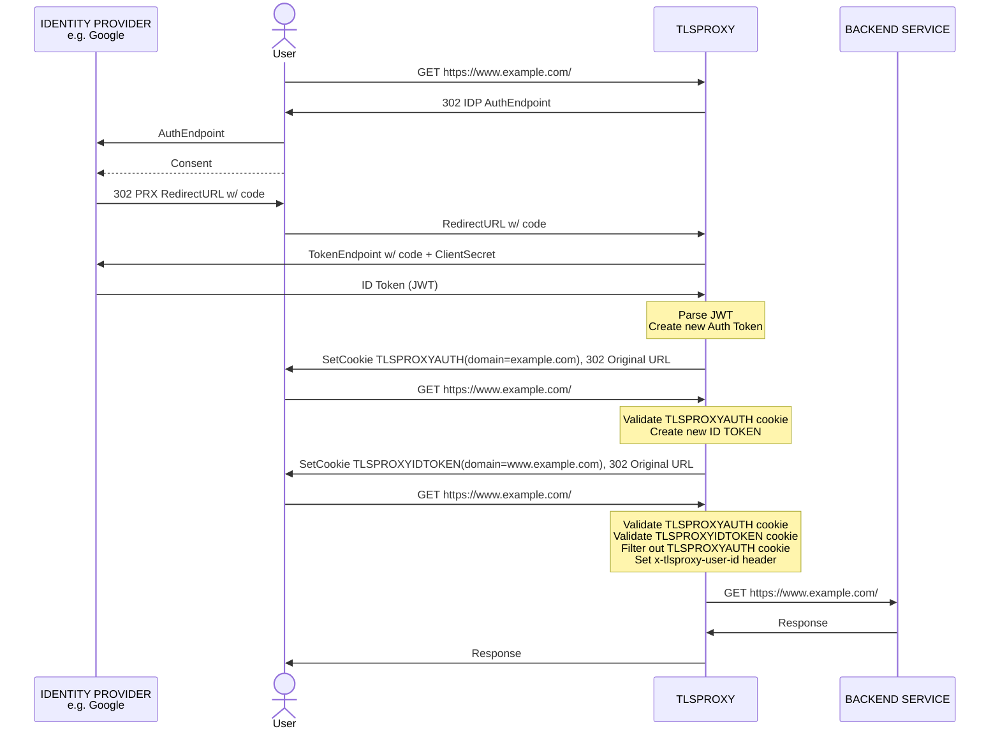
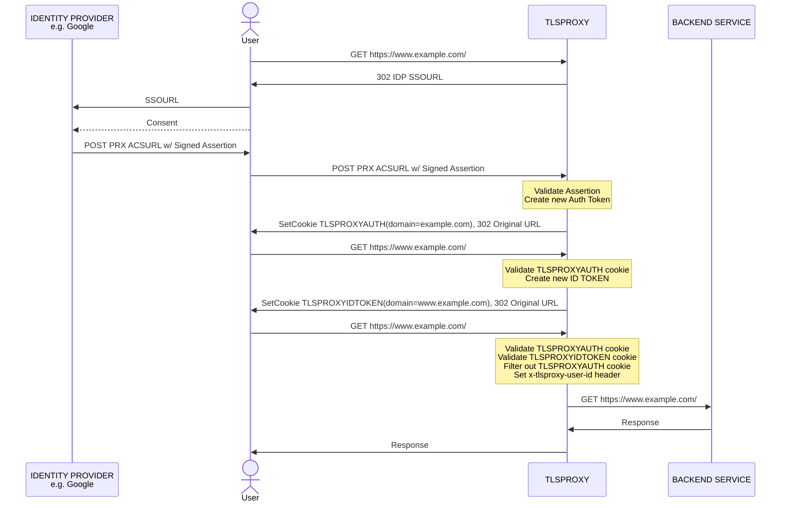

# User Authentication

Simplified sequence diagrams representing the OIDC and SAML authentication flows.

## OIDC Flow

```mermaid
sequenceDiagram
  participant IDP as IDENTITY PROVIDER<br>e.g. Google
  actor A as User
  participant PRX as TLSPROXY
  participant BE as BACKEND SERVICE

  A->>PRX: GET https://www.example.com/
  PRX->>A: 302 IDP AuthEndpoint
  A->>IDP: AuthEndpoint
  A-->>IDP: Consent
  IDP->>A: 302 PRX RedirectURL w/ code
  A->>PRX: RedirectURL w/ code

  PRX->>IDP: TokenEndpoint w/ code + ClientSecret
  IDP->>PRX: ID Token (JWT)

  Note over PRX: Parse JWT<br>Create new Auth Token
  PRX->>A: SetCookie TLSPROXYAUTH(domain=example.com), 302 Original URL
  A->>PRX: GET https://www.example.com/

  Note over PRX: Validate TLSPROXYAUTH cookie<br>Create new ID TOKEN
  PRX->>A: SetCookie TLSPROXYIDTOKEN(domain=www.example.com), 302 Original URL
  A->>PRX: GET https://www.example.com/
  Note over PRX: Validate TLSPROXYAUTH cookie<br>Validate TLSPROXYIDTOKEN cookie<br>Filter out TLSPROXYAUTH cookie<br>Set x-tlsproxy-user-id header

  PRX->>BE: GET https://www.example.com/
  BE->>PRX: Response
  PRX->>A: Response
```

## SAML Flow

```mermaid
sequenceDiagram
  participant IDP as IDENTITY PROVIDER<br>e.g. Google
  actor A as User
  participant PRX as TLSPROXY
  participant BE as BACKEND SERVICE

  A->>PRX: GET https://www.example.com/
  PRX->>A: 302 IDP SSOURL
  A->>IDP: SSOURL
  A-->>IDP: Consent
  IDP->>A: POST PRX ACSURL w/ Signed Assertion
  A->>PRX: POST PRX ACSURL w/ Signed Assertion

  Note over PRX: Validate Assertion<br>Create new Auth Token
  PRX->>A: SetCookie TLSPROXYAUTH(domain=example.com), 302 Original URL
  A->>PRX: GET https://www.example.com/

  Note over PRX: Validate TLSPROXYAUTH cookie<br>Create new ID TOKEN
  PRX->>A: SetCookie TLSPROXYIDTOKEN(domain=www.example.com), 302 Original URL
  A->>PRX: GET https://www.example.com/
  Note over PRX: Validate TLSPROXYAUTH cookie<br>Validate TLSPROXYIDTOKEN cookie<br>Filter out TLSPROXYAUTH cookie<br>Set x-tlsproxy-user-id header

  PRX->>BE: GET https://www.example.com/
  BE->>PRX: Response
  PRX->>A: Response
```
