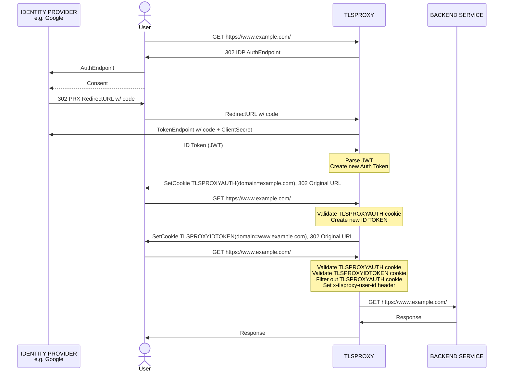
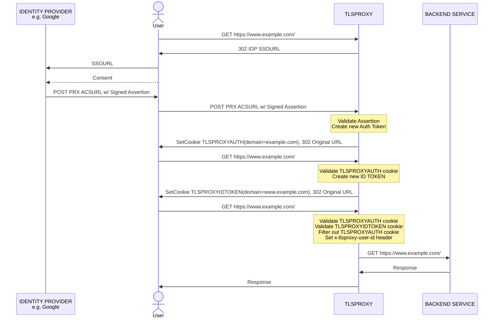

# User Authentication

Simplified sequence diagrams representing the OIDC and SAML authentication flows.

Refer to the [SSO example](https://github.com/c2FmZQ/tlsproxy/blob/main/examples/sso/README.md) and the [Config godoc](https://pkg.go.dev/github.com/c2FmZQ/tlsproxy/proxy#Config).

## OIDC Flow

## SAML Flow

## Cookies

The values of the `TLSPROXYAUTH` and `TLSPROXYIDTOKEN` cookies are JSON Web Tokens (JWT) signed by tlsproxy itself.

`TLSPROXYAUTH` is used to authenticate with tlsproxy. It is not forwarded to the backend services.

`TLSPROXYIDTOKEN` is used to authenticate with the backend services. It is set and validated by tlsproxy. The backend services can also validate it using the JSON Web Key Set (JWKS) exported by tlsproxy.

The ID Token can also be passed in the `Authorization` http header as a bearer token.
